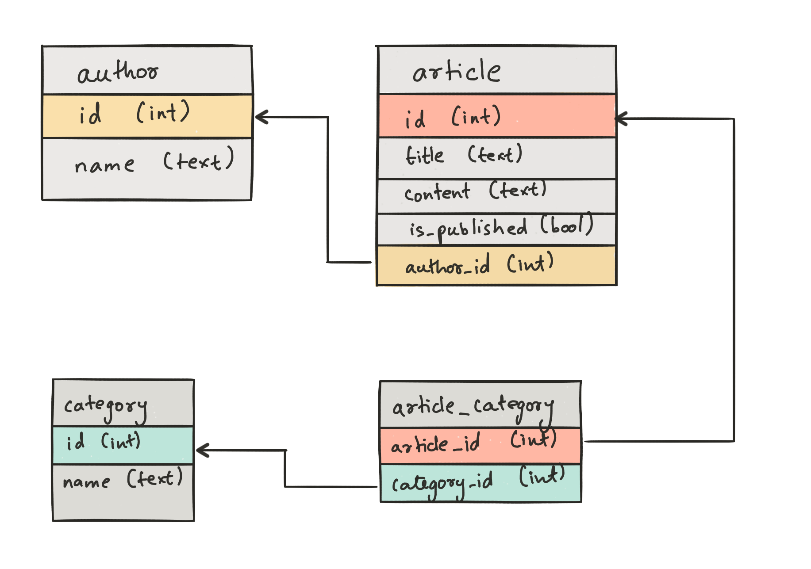

Relationships
---------------

Let's consider this schema for the rest of this section

Relationships are connections between tables. They simplify queries on related data. Let's say on our medium like application (with the above schema), we have an author page. To render this page, we would need the author information and their articles. With our current knowledge of data APIs, we would use these queries:

.. code-block:: http

   POST /v1/query HTTP/1.1
   Content-Type: application/json
   Authorization: <admin-token>

   {
       "type" : "select",
       "args" : {
           "table" : "author",
           "columns": ["name"],
           "where" : {"id" : 1}
       }
   }

and

.. code-block:: http

   POST /v1/query HTTP/1.1
   Content-Type: application/json
   Authorization: <admin-token>

   {
       "type" : "select",
       "args" : {
           "table" : "article",
           "columns": ["id", "title"],
           "where" : {
               "is_published" : true,
               "author_id" : 1
           }
       }
   }

or probably wrap them up in a single ``bulk`` query. Imagine the complexity if you also have to fetch the categories of every article.

Now let's see how relationships can help us. From the above schema, we can see that an **author** *has many* **articles** and an **article** *belongs to* an **author**. As you may have guessed, the foreign key constraints help us define these relationships.

In Hasura's terminology, we call **articles** an *array relationship* of **author** and **author** an *object relationship* of **article**. You can define relationships by heading to the "Relationships" section of a table in api-console. With relationships, the query to fetch data to render author page would be as follows:

.. code-block:: http
   :emphasize-lines: 11-14

   POST /v1/query HTTP/1.1
   Content-Type: application/json
   Authorization: <admin-token>

   {
       "type" : "select",
       "args" : {
           "table" : "author",
           "columns": [
               "name",
               {
                   "name": "articles",
                   "columns": ["title"]
               }
           ],
           "where" : {"id" : 1}
       }
   }

Similarly, if we need to fetch the author's name along with an article, we can write a query as follows:

.. code-block:: http
   :emphasize-lines: 12-15

   POST /v1/query HTTP/1.1
   Content-Type: application/json
   Authorization: <admin-token>

   {
       "type" : "select",
       "args" : {
           "table" : "article",
           "columns": [
               "title",
               "content",
               {
                   "name": "author",
                   "columns": ["name"]
               }
           ],
           "where" : {"id" : 1}
       }
   }

Relationships can be used in a ``where`` clause. For example, if we wish to only fetch all published articles by an author with name ``Warren``:

.. code-block:: http
   :emphasize-lines: 12

   POST /v1/query HTTP/1.1
   Content-Type: application/json
   Authorization: <admin-token>

   {
       "type" : "select",
       "args" : {
           "table" : "article",
           "columns": [ "id", "title"],
           "where" : {
               "is_published" : true,
               "author" : {"name" : "Warren"}
           }
       }
   }

To fetch authors who have never published anything.

.. code-block:: http
   :emphasize-lines: 11

   POST /v1/query HTTP/1.1
   Content-Type: application/json
   Authorization: <admin-token>

   {
       "type" : "select",
       "args" : {
           "table" : "author",
           "columns": ["name"],
           "where" : {
               "$not" : {"articles" : {"is_published" : true}}
           }
       }
   }

In the above query, ``{"articles" : {"is_published" : true}}`` evaluates to ``true`` if *any* article of that author satisfies ``{"is_published" : true}``.

The ``where`` clause can be used inside array relationships (and as you may have guessed, ``order_by``, ``limit`` and ``offset`` too). To fetch all authors and only their published articles:

.. code-block:: http
   :emphasize-lines: 14

   POST /v1/query HTTP/1.1
   Content-Type: application/json
   Authorization: <admin-token>

   {
       "type" : "select",
       "args" : {
           "table" : "author",
           "columns": [
               "name",
               {
                   "name": "articles",
                   "columns": ["title"],
                   "where" : { "is_published" : true }
               }
           ]
       }
   }

Relationships can be nested. If we extended our ideas of array and object relationships to article and category tables, we can write a query which fetches an author, their articles and every article's categories.

.. code-block:: http
   :emphasize-lines: 15-23

   POST /v1/query HTTP/1.1
   Content-Type: application/json
   Authorization: <admin-token>

   {
       "type" : "select",
       "args" : {
           "table" : "author",
           "columns": [
               "name",
               {
                   "name": "articles",
                   "columns": [
                       "title",
                       {
                           "name": "categories",
                           "columns": [
                               {
                                   "name" : "category",
                                   "columns" : ["name"]
                               }
                           ]
                       }
                   ]
               }
           ],
           "where" : {"id" : 1}
       }
   }
